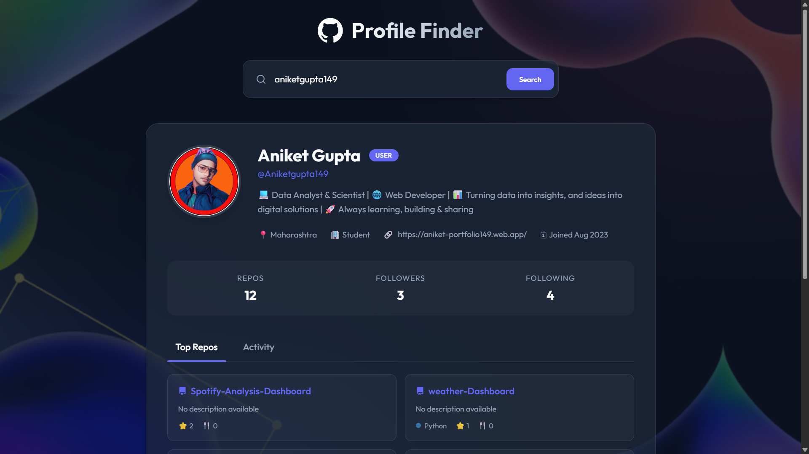

# GitHub Profile Finder



## 📋 Project Overview

**GitHub Profile Finder** is a modern, responsive web application that allows users to search for GitHub profiles and view detailed information about developers. Built with a focus on user experience and visual aesthetics, it utilizes the GitHub REST API to fetch and display real-time data.

This project demonstrates the integration of third-party APIs, asynchronous JavaScript, and modern CSS styling techniques (Glassmorphism).

## ✨ Key Features

- **🔍 Instant Search**: Search for any GitHub user by their username.
- **👤 Comprehensive Profile View**: Displays user avatar, bio, location, company, blog, and join date.
- **📊 Live Statistics**: Shows real-time counts for public repositories, followers, and following.
- **📂 Repository Explorer**: Lists top repositories with descriptions, languages, and stars.
- **🎨 Modern UI/UX**: Features a sleek, dark-themed interface with glassmorphism effects and smooth animations.
- **📱 Fully Responsive**: Optimized for desktops, tablets, and mobile devices.

## 🛠️ Technology Stack

- **Frontend Structure**: HTML5 (Semantic)
- **Styling**: CSS3 (Variables, Flexbox, Grid, Glassmorphism, Animations)
- **Logic & API**: Vanilla JavaScript (ES6+, Fetch API, Async/Await)
- **Data Source**: [GitHub REST API](https://docs.github.com/en/rest)
- **Fonts**: 'Outfit' from Google Fonts
- **Icons**: SVG Icons

## 🚀 How to Run Locally

1.  **Clone or Download** the repository.
2.  **Open the Project folder**.
3.  **Launch the Application**:
    *   Simply double-click `index.html` to open it in your default web browser.
    *   OR use a live server extension (like Live Server in VS Code) for the best experience.

## 📖 Usage Guide

1.  **Enter Username**: Type a GitHub username (e.g., `torvalds`, `facebook`) in the search bar.
2.  **Search**: Click the "Search" button or press Enter.
3.  **View Results**:
    *   If the user exists, their profile card will appear with all details.
    *   Switch between "Top Repos" and "Activity" tabs to see more data.
    *   Click on repository cards to visit them on GitHub.
4.  **Error Handling**: If a user is not found, an error message will be displayed.

## 📂 Project Structure

```
GitHub-Profile-Finder/
├── index.html      # Main HTML structure
├── style.css       # All styles and animations
├── script.js       # Application logic and API handling
├── github-logo.png # Project assets
├── Untitled.png    # Background image
└── README.md       # Project documentation
```

## 🔮 Future Improvements

- [ ] Add pagination for repositories.
- [ ] Implement a "Recent Searches" history.
- [ ] Add a light/dark mode toggle.
- [ ] Visualize commit history with charts.

---

<p align="center">
  Crafted with ❤️ by Aniket Gupta

</p>
